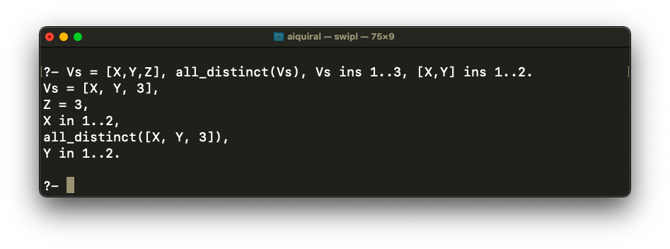
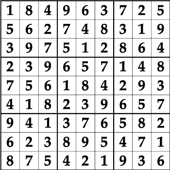

# INTRODUCTION

A **Latin square** of order _n_ is an _n × n_ array in which each cell contains a single symbol

from a set _S_ with _n_ elements, such that each symbol occurs exactly once in each row

and exactly once in each column.

_Example:_

<br>
a Latin square of order 3

A **Sudoku Latin square** is a Latin square of order 9 on the symbol set {1,..., 9} that

is partitioned into 3 _×_ 3 squares, and each square contains all symbols.<br>


This can also be represented as<br>


This can be further represented as a list of variables:<br>


And we represent the whole sudoku latin square as a list of lists.<br>


So, in total, we have a list of rows.


# CLP(FD) CONSTRAINTS

The library clpfd or Constraint Logic Programming over Finite Domains contains a lot

of built-in predicates that are useful for solving the Sudoku puzzle easily.

**(ins)/2** states the domains of variables
    in some systems: fd_domain/3, domain/

**all_distinct/**
    or alternatively: all_different/1, fd_all_different.
    describes a list of different integers

_Examples_ :<br>


Constraint Propagation:<br>

<br><br>

# CONSISTENCY TECHNIQUES

**all_distinct/1** uses powerful methods from graph theory to prune the search space:

Using the previous example, the following graph states that X can be either 1 or 2, Y

can be either 1 or 2 and Z can be either 1, 2 or 3.<br>


This is a value graph for a set of constraints.

Prolog automatically reasons about this value graph to detect whether there can still

be a solution and also to find out which assignment can not occur in a solution.<br>
 &nbsp; 

# PROGRAM

```
:- use_module(library(clpfd)). % Including clpfd library.

% Defining a sudoku latin square:

sudoku (Rows) :-

    % Rows must be a list of length 9.
    length (Rows, 9),

    %Each of the rows must also be a list of 9.
    maplist(same_length(Rows), Rows),

    % The concatenation of all elements of this list is the list Vs.
    append(Rows, Vs),
    Vs ins 1..9,

    % We can define the all the elements of each of the rows
    % must be purely distinct.
    % We can do the following:
    % Rows = [Rs1|_], all_distinct(Rs1),
    % Rows = [_,Rs2|_], all_distinct(Rs2),
    % ...
    % But there is a simpler way to do this.

    maplist(all_distinct, Rows),
    % This states that all_distinct must hold for each of the rows.

    % Doing the same with columns.
    transpose(Rows, Columns),
    maplist(all_distinct, Columns),

    % Defining the sub-squares.
    Rows = [As,Bs,Cs,Ds,Es,Fs,Gs,Hs,Is],
    square(As, Bs, Cs),
    square(Ds, Es, Fs),
    square(Gs, Hs, Is).

square([], [], []). % This predicate uses 3 rows.

square([N1,N2,N3|Ns1],
       [N4,N5,N6|Ns2],
       [N7,N8,N9|Ns3]) :-
        all_distinct([N1,N2,N3,N4,N5,N6,N7,N8,N9]),
        square(Ns1, Ns2, Ns3).


% Defining different problems.

problem(1, [[_,_,_,_,_,4,_,_,2],
            [_,6,_,2,_,_,_,3,_],
            [_,8,_,_,_,3,5,_,9],
            [_,4,_,_,_,_,1,_,_],
            [1,_,_,7,_,5,_,_,_],
            [5,_,3,_,_,_,_,_,_],
            [_,9,_,3,_,_,_,_,_],
            [_,_,4,_,6,1,_,_,_],
            [_,_,5,_,_,_,7,_,_]]).

problem(2, [[_,_,9,5,_,_,_,3,7],
            [1,3,7,9,_,_,_,5,2],
            [2,_,_,_,_,3,6,9,_],
            [3,5,2,_,1,_,_,_,6],
            [_,_,_,4,5,2,3,_,_],
            [_,8,1,_,3,_,2,_,_],
            [6,_,3,_,4,_,8,_,9],
            [5,2,_,_,_,1,_,6,_],
            [_,_,_,3,_,7,_,_,_]]).

problem(3, [[_,5,_,1,_,_,_,_,_],
            [2,_,_,5,_,_,6,_,_],
            [1,_,_,_,8,_,2,_,_],
            [_,8,_,4,3,_,_,_,_],
            [_,_,_,_,_,_,_,4,_],
            [_,_,_,_,_,7,9,3,2],
            [_,4,_,6,7,_,_,_,_],
            [_,7,_,_,_,_,_,1,9],
            [9,_,_,_,_,8,_,_,_]]).
```

# SOLUTION

We can get the solution using the following queries:
```
problem(1,Rows), sudoku(Rows), maplist(portray_clause, Rows).
```

```
problem(2,Rows), sudoku(Rows), maplist(portray_clause, Rows).
```

```
problem(3,Rows), sudoku(Rows), maplist(portray_clause, Rows).
```

# ANOTHER EXAMPLE

Following is the step by step method of how prolog solves the Sudoku puzzle using
intelligent constraint propagation.<br>
 &nbsp; <br>
 &nbsp; <br>
 &nbsp; <br>

Inconsistent values are indicated by small dots. Black dots represent “obvious”
propagation, whereas, blue dots represent “intelligent” propagation.<br>
 &nbsp; <br>

# REFERENCES

- https://metalevel.at/sudoku
- https://www.swi-prolog.org/man/clpfd.html